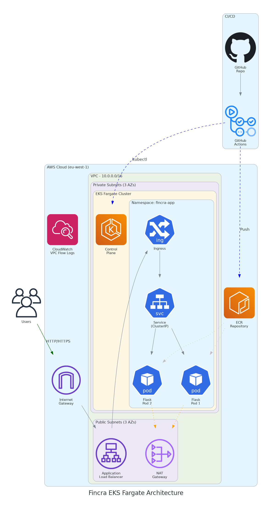

# Fincra DevOps Take-Home Assessment

A production-ready Infrastructure-as-Code (IaC) solution for deploying a Flask web application on AWS EKS Fargate with complete CI/CD automation using GitHub Actions.

## 📋 Table of Contents

- [Overview](#overview)
- [Architecture](#architecture)
- [Project Structure](#project-structure)
- [Prerequisites](#prerequisites)
- [Installation](#installation)
- [Usage](#usage)
- [Security Configuration](#security-configuration)
- [CI/CD Pipeline](#cicd-pipeline)
- [Kubernetes Resources](#kubernetes-resources)
- [Assumptions](#assumptions)
- [Design Decisions](#design-decisions)
- [Troubleshooting](#troubleshooting)

## Overview

This solution recreates a manually configured cloud infrastructure that was accidentally deleted, capturing it as Infrastructure-as-Code (IaC) to enable:

- **Reproducible deployments** - Infrastructure can be recreated identically
- **Version control** - All changes are tracked in Git
- **Collaboration** - Team members can review and contribute to infrastructure changes
- **Resilience** - Quick recovery from incidents

### Key Features

- ✅ AWS EKS Fargate cluster for serverless Kubernetes
- ✅ VPC with public/private subnets across 3 AZs
- ✅ Security groups with specified firewall rules
- ✅ AWS Application Load Balancer via Ingress controller
- ✅ ECR repository for container images
- ✅ Complete CI/CD pipeline with GitHub Actions
- ✅ Kubernetes manifests with Kustomize support

## Architecture



### Security Group Rules

| Direction | Protocol | Port(s)   | Source/Destination | Description                    |
|-----------|----------|-----------|-------------------|--------------------------------|
| Egress    | All      | All       | 0.0.0.0/0         | Allow all outbound traffic     |
| Ingress   | TCP      | 80        | 0.0.0.0/0         | HTTP from internet             |
| Ingress   | TCP      | 443       | 0.0.0.0/0         | HTTPS from internet            |
| Ingress   | ICMP     | -         | 0.0.0.0/0         | Ping from internet             |
| Ingress   | TCP      | All       | 10.0.0.0/16       | Internal VPC TCP traffic       |
| Ingress   | UDP      | All       | 10.0.0.0/16       | Internal VPC UDP traffic       |

## Project Structure

```
devops-take-home/
├── .github/
│   └── workflows/
│       └── config.yml          # GitHub Actions CI/CD pipeline
├── cdk/
│   ├── bin/
│   │   └── app.ts              # CDK application entry point
│   ├── lib/
│   │   └── infrastructure-stack.ts  # Main infrastructure stack
│   ├── cdk.json                # CDK configuration
│   ├── package.json            # Node.js dependencies
│   └── tsconfig.json           # TypeScript configuration
├── docs/
│   └── architecture-diagram.png # Architecture diagram
├── k8s/
│   ├── namespace.yaml          # Kubernetes namespace
│   ├── deployment.yaml         # Flask app deployment
│   ├── service.yaml            # ClusterIP service
│   ├── ingress.yaml            # ALB ingress configuration
│   └── kustomization.yaml      # Kustomize configuration
├── scripts/
│   └── deploy.sh               # Deployment helper script
├── app.py                      # Flask application
├── Dockerfile                  # Container image definition
├── docker-compose.yml          # Local development
├── Makefile                    # Build commands
├── requirements.txt            # Python dependencies
└── README.md                   # This file
```

## Prerequisites

### Required Tools

- **AWS CLI** (v2.x) - [Installation Guide](https://docs.aws.amazon.com/cli/latest/userguide/getting-started-install.html)
- **Node.js** (v18+) - [Installation Guide](https://nodejs.org/)
- **AWS CDK** (v2.x) - `npm install -g aws-cdk`
- **Docker** - [Installation Guide](https://docs.docker.com/get-docker/)
- **kubectl** (v1.30+) - [Installation Guide](https://kubernetes.io/docs/tasks/tools/)
- **kustomize** - [Installation Guide](https://kubectl.docs.kubernetes.io/installation/kustomize/)

### AWS Permissions

The IAM user/role requires the following permissions:

- EC2 (VPC, Security Groups, Subnets)
- EKS (Cluster, Fargate Profiles)
- ECR (Repository management)
- IAM (Roles, Policies)
- ELB (Application Load Balancers)
- CloudWatch (Logs)
- CloudFormation (Stack management)

## Installation

### 1. Clone the Repository

```bash
git clone https://github.com/leke-ariyo/devops-take-home.git
cd devops-take-home
```

### 2. Configure AWS Credentials

```bash
aws configure
# Enter your AWS Access Key ID, Secret Access Key, and region (eu-west-1)
```

### 3. Install CDK Dependencies

```bash
cd cdk
npm install
cd ..
```

### 4. Bootstrap CDK (First time only)

```bash
cd cdk
cdk bootstrap aws://ACCOUNT_ID/eu-west-1
cd ..
```

### 5. Configure GitHub Secrets

Add these secrets to your GitHub repository:

| Secret Name            | Description                    |
|-----------------------|--------------------------------|
| `AWS_ACCESS_KEY_ID`   | AWS IAM access key             |
| `AWS_SECRET_ACCESS_KEY` | AWS IAM secret key           |
| `AWS_ACCOUNT_ID`      | AWS account ID                 |

## Usage

### Local Development

Run the Flask app locally with Docker:

```bash
# Using docker-compose
docker-compose up --build

# Or using Make
make up

# Access at http://localhost:80
```

### Manual Deployment

Use the deployment helper script:

```bash
# Check prerequisites
./scripts/deploy.sh check

# Full deployment (build, push, infrastructure, application)
./scripts/deploy.sh all

# Or step by step:
./scripts/deploy.sh build latest        # Build Docker image
./scripts/deploy.sh push latest         # Push to ECR
./scripts/deploy.sh infra               # Deploy CDK infrastructure
./scripts/deploy.sh deploy latest       # Deploy to EKS

# Get application URL
./scripts/deploy.sh url

# Check status
./scripts/deploy.sh status

# Cleanup (destroy all resources)
./scripts/deploy.sh cleanup
```

### CDK Commands

```bash
cd cdk

# Synthesize CloudFormation template
cdk synth

# Show infrastructure diff
cdk diff

# Deploy infrastructure
cdk deploy --all

# Destroy infrastructure
cdk destroy --all
```

### Kubernetes Commands

```bash
# Update kubeconfig
aws eks update-kubeconfig --name fincra-eks-cluster --region eu-west-1

# Apply manifests
kubectl apply -k k8s/

# Check deployment status
kubectl get all -n fincra-app

# View logs
kubectl logs -l app=fincra-flask-app -n fincra-app

# Get ALB URL
kubectl get ingress -n fincra-app
```

## Security Configuration

### VPC Configuration

- **CIDR**: 10.0.0.0/16
- **Availability Zones**: 3
- **Public Subnets**: For ALB and NAT Gateway
- **Private Subnets**: For EKS Fargate pods
- **NAT Gateway**: 1 (for cost optimization)
- **VPC Flow Logs**: Enabled for security monitoring

### Security Groups

The application security group implements the specified firewall rules:

```typescript
// Allow all egress
allowAllOutbound: true

// Ingress rules
- TCP 80 from 0.0.0.0/0 (HTTP)
- TCP 443 from 0.0.0.0/0 (HTTPS)
- ICMP ping from 0.0.0.0/0
- All TCP within VPC (10.0.0.0/16)
- All UDP within VPC (10.0.0.0/16)
```

## CI/CD Pipeline

The GitHub Actions workflow consists of 6 jobs:

### 1. Lint and Test
- Python linting with flake8
- Basic sanity tests for Flask app

### 2. Build and Push
- Builds Docker image
- Pushes to Amazon ECR
- Tags with commit SHA and `latest`

### 3. CDK Synth
- Synthesizes CloudFormation templates
- Runs `cdk diff` for review
- Uploads artifacts

### 4. Deploy Infrastructure
- Bootstraps CDK (if needed)
- Deploys VPC, EKS cluster, security groups
- Exports stack outputs

### 5. Deploy Application
- Updates kubeconfig
- Applies Kubernetes manifests with Kustomize
- Waits for rollout completion

### 6. Smoke Tests
- Verifies pods are running
- Tests health and main endpoints
- Reports application URL

## Kubernetes Resources

### Deployment (`k8s/deployment.yaml`)

- **Replicas**: 2 (high availability)
- **Strategy**: RollingUpdate (zero-downtime)
- **Resources**:
  - Requests: 256m CPU, 512Mi memory
  - Limits: 512m CPU, 1Gi memory
- **Probes**: Liveness and readiness checks

### Service (`k8s/service.yaml`)

- **Type**: ClusterIP
- **Port**: 80

### Ingress (`k8s/ingress.yaml`)

- **Class**: ALB (AWS Load Balancer Controller)
- **Scheme**: Internet-facing
- **Target Type**: IP (required for Fargate)
- **Health Checks**: Configured for `/health`

## Assumptions

1. **AWS Region**: Default is `eu-west-1` (Ireland). Can be changed via environment variables.

2. **DNS/SSL**: The solution provides HTTP access. For production, add:
   - ACM certificate for SSL/TLS
   - Route53 for custom domain
   - Uncomment SSL redirect in ingress annotations

3. **Fargate Pricing**: Using Fargate for simplicity and cost optimization for small workloads. For larger workloads, consider EC2 node groups.

4. **Single NAT Gateway**: Using 1 NAT Gateway for cost optimization. For production high availability, increase to 3 (one per AZ).

5. **Kubernetes Version**: Using EKS 1.30 (latest stable). Upgrade path should be planned for newer versions.

6. **Container Registry**: Using ECR. The repository is created as part of the CDK stack.

7. **GitHub Actions**: Using free tier. For large teams, consider self-hosted runners.

## Design Decisions

### Why AWS CDK?

- **Type Safety**: TypeScript provides compile-time checks
- **Abstraction Level**: Higher-level constructs reduce boilerplate
- **Ecosystem**: Good integration with AWS services
- **Testing**: Easy to unit test infrastructure code

### Why EKS Fargate?

- **Serverless**: No node management required
- **Cost**: Pay per pod, suitable for variable workloads
- **Security**: Pod-level isolation
- **Scaling**: Automatic with no capacity planning

### Why Kustomize?

- **Native**: Built into kubectl
- **Simple**: No templating language to learn
- **Overlays**: Easy environment-specific configurations
- **GitOps Ready**: Works well with Argo CD

### Why Application Load Balancer?

- **Layer 7**: Path-based routing support
- **Integration**: Native AWS integration
- **Features**: SSL termination, WAF support
- **Cost**: More cost-effective than NLB for HTTP traffic

## Troubleshooting

### Common Issues

**Pod stuck in Pending state**
```bash
kubectl describe pod -n fincra-app
# Check if Fargate profile matches the namespace
```

**ALB not provisioning**
```bash
kubectl logs -n kube-system -l app.kubernetes.io/name=aws-load-balancer-controller
# Check IAM permissions for the controller
```

**ECR push failures**
```bash
aws ecr get-login-password --region eu-west-1 | docker login --username AWS --password-stdin ACCOUNT_ID.dkr.ecr.eu-west-1.amazonaws.com
# Ensure ECR repository exists
```

**CDK deployment failures**
```bash
cdk doctor
# Check CDK version and AWS credentials
```

### Useful Commands

```bash
# View all resources in namespace
kubectl get all -n fincra-app

# Describe pod for details
kubectl describe pod POD_NAME -n fincra-app

# View pod logs
kubectl logs -f POD_NAME -n fincra-app

# Port forward for local testing
kubectl port-forward svc/fincra-flask-app 8080:80 -n fincra-app

# View AWS Load Balancer Controller logs
kubectl logs -n kube-system -l app.kubernetes.io/name=aws-load-balancer-controller
```

## Contributing

1. Fork the repository
2. Create a feature branch
3. Make your changes
4. Submit a pull request

## License

This project is for assessment purposes only.
